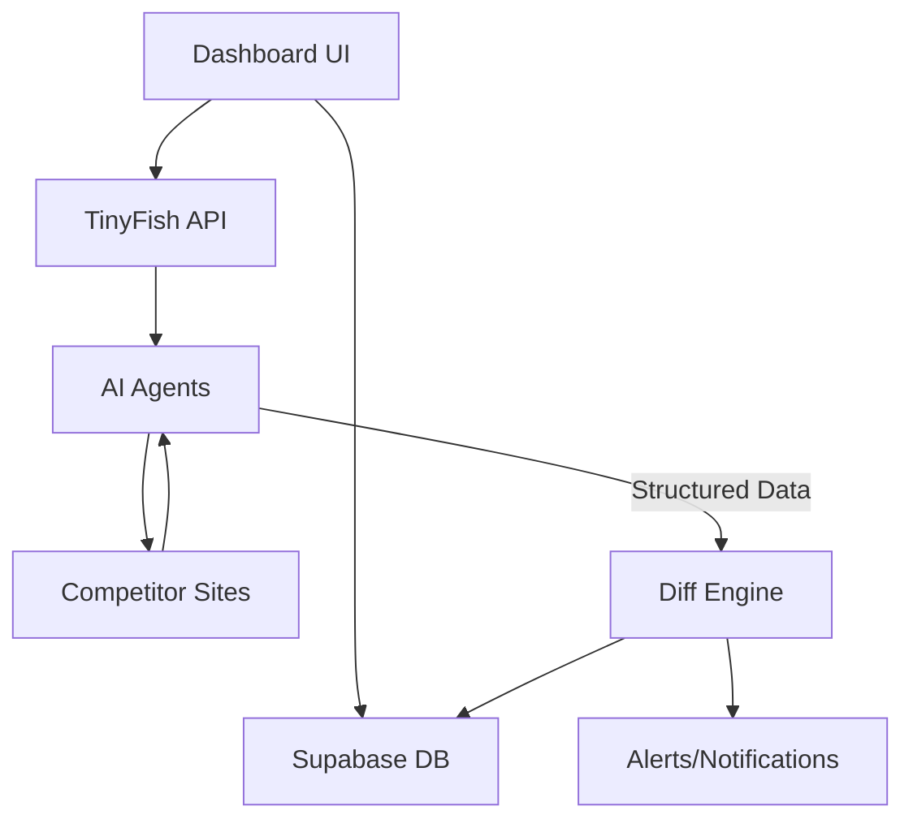

<div align="center">

# ⚡ PricePulse AI
### **Agentic Competitive Intelligence for the Modern E-commerce**

[](https://nextjs.org/)
[](https://tailwindcss.com/)
[](https://supabase.com/)
[](https://agent.tinyfish.ai/)

[**Explore the Demo**](https://pricepulse-ai.vercel.app) • [**Read the Core Idea**](PricePulse%20AI_%20The%20Core%20Idea%20for%20Tinyfish%20Accelerator.md) • [**Documentation**](GEMINI.md)

</div>

---

## 🔍 The Problem: Brittle Scraping
Traditional e-commerce monitoring relies on fragile CSS selectors that break with every website update. This leads to **blind spots**, **stale data**, and **manual overhead**.

## 💡 The Solution: PricePulse AI
**PricePulse AI** transforms competitive intelligence by deploying autonomous **AI Agents** that mimic human browsing behavior. Built on the **TinyFish Agentic Web** philosophy, it doesn't just scrape; it *understands*.

### ✨ Key Features

- 🤖 **Autonomous AI Agents**: Uses natural language goals to navigate complex, dynamic, and bot-protected sites.
- 📡 **Real-time SSE Streaming**: Watch your agents "think" and act in real-time through a live execution stream.
- 📉 **Intelligent Diff Engine**: Automatically detects price drops, restocks, and promotional shifts with severity scoring.
- 📊 **Strategic Dashboard**: Comprehensive visualization of competitor trends using interactive Recharts.
- 📧 **Instant Alerts**: Get notified via email or in-app alerts the moment a competitor changes their strategy.

---

## 🛠️ Tech Stack

PricePulse AI is built with a cutting-edge, type-safe stack designed for performance and scalability.

| Layer | Technology |
| :--- | :--- |
| **Frontend** | Next.js 16 (App Router), React 19, TypeScript |
| **Styling** | Tailwind CSS 4, Radix UI, Framer Motion |
| **Backend** | Next.js Serverless Functions, Supabase (PostgreSQL) |
| **AI Engine** | TinyFish Mino Agent (Web Automation) |
| **Analytics** | Recharts, Date-fns |

---

## 🚀 Getting Started

### 1. Prerequisites
- Node.js 20+
- A [Supabase](https://supabase.com/) project
- A [TinyFish API Key](https://agent.tinyfish.ai/)

### 2. Installation
```bash
# Clone the repository
git clone https://github.com/your-username/pricepulse-ai.git

# Navigate to the directory
cd pricepulse-ai

# Install dependencies
npm install
```

### 3. Configuration
Create a `.env.local` file in the root directory:
```env
NEXT_PUBLIC_SUPABASE_URL=your_supabase_url
NEXT_PUBLIC_SUPABASE_ANON_KEY=your_supabase_anon_key
TINYFISH_API_KEY=your_tinyfish_key
```

### 4. Run Development Server
```bash
npm run dev
```
Open [http://localhost:3000](http://localhost:3000) to see your dashboard.

---

## 🏗️ Architecture



---

## 🤝 Contributing
We welcome contributions! Whether it's a bug fix, a new feature, or feedback on the agent prompts, please feel free to open an issue or a pull request.

## 📄 License
This project is licensed under the [MIT License](LICENSE).

---

<div align="center">
  Built with ❤️ for the <b>Tinyfish Accelerator</b>
</div>
